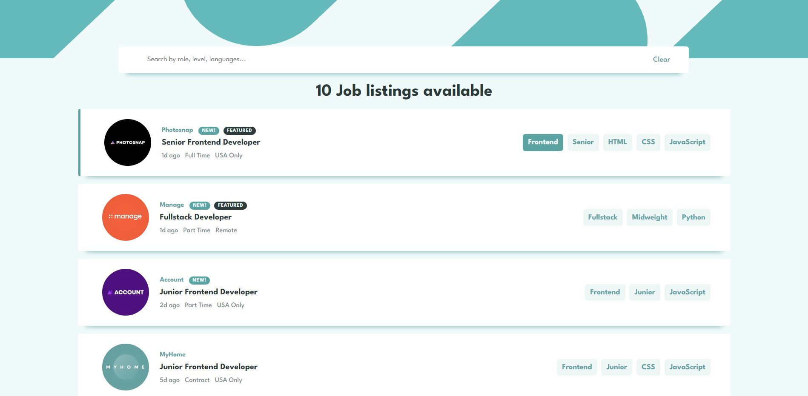
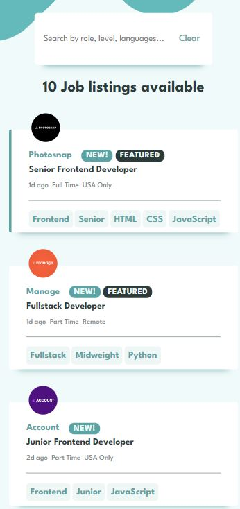

# Job listings

- [Sobre o projeto ](#sobre-o-projeto)
- [Screenshots](#screenshots)
- [Techs](#techs)

## Sobre o projeto

Job Listings é uma página que mostra uma lista de vagas de emprego disponíveis e sua quantidade, utilizando a biblioteca React Js e arquivo json para buscar os dados e adicioná-los de forma dinâmica. Possui layout responsivo conforme o tamanho da tela do usuário e elementos interativos com estado de foco.

Próximas implementações:

- Funcionalidade para filtras as vagas com base nas categorias Role, Level e Languages.

## Screenshots

## Techs

- HTML semântico
- CSS
- Flexbox
- Javascript
- React Js

## Frontend Mentor

Solução para o desafio [Job listings with filtering challenge on Frontend Mentor](https://www.frontendmentor.io/challenges/job-listings-with-filtering-ivstIPCt).

- [@biancamarquezi](https://www.frontendmentor.io/profile/biancamarquezi)
